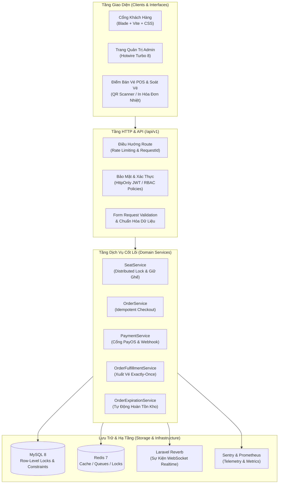

# Cinema — Nền Tảng Quản Trị & Đặt Vé Xem Phim Trực Tuyến

[](https://github.com/nguyentruongsonn/cinema/actions/workflows/quality.yml)
[](https://php.net)
[](https://laravel.com)
[](https://mysql.com)
[](https://redis.io)
[](https://turbo.hotwired.dev)
[](https://tailwindcss.com)
[](tests/)
[](phpstan.neon)

Cinema là nền tảng quản trị và đặt vé xem phim trực tuyến đạt chuẩn production, được xây dựng theo kiến trúc **Modular Monolith** với **Laravel 12**, **MySQL 8**, **Redis** và **Hotwire Turbo 8**. Hệ thống tích hợp quy trình tuần tự hóa đặt vé (booking serialization), xử lý thanh toán cổng PayOS, cập nhật trạng thái ghế theo thời gian thực (real-time) qua WebSockets, kiểm soát vé nguyên tử qua mã QR (atomic QR verification), cùng các cơ chế bảo mật và giám sát hệ thống chuẩn doanh nghiệp.

---

## 🏛️ Sơ Đồ Kiến Trúc Hệ Thống



---

## 💡 Điểm Sáng Kỹ Thuật (Key Engineering Highlights)

### 1. Cơ Chế Khóa Ghế & Xử Lý Đồng Thời Cao (High-Concurrency Seat Locking)
- **Kiểm soát đồng thời phân tán:** Kết hợp Redis distributed locks, MySQL row-level locks (`SELECT ... FOR UPDATE`) và compound unique indexes ở tầng cơ sở dữ liệu để đảm bảo triệt tiêu hoàn toàn race condition, chống đặt trùng ghế (double-booking) khi nhiều người cùng chọn ghế đồng thời.
- **Snapshot sơ đồ phòng chiếu bất biến:** Lưu trữ ảnh chụp layout ghế tại thời điểm tạo suất chiếu, bảo vệ các đơn hàng đang hoạt động không bị ảnh hưởng nếu rạp có điều chỉnh sơ đồ ghế sau đó.
- **Tự động hoàn trả ghế & khuyến mại:** Background worker tự động giải phóng các ghế giữ chỗ hết hạn (seat hold expiration) và hoàn lại lượt sử dụng mã ưu đãi / điểm thành viên.

### 2. Thanh Toán Chống Trùng Lặp & Webhook Replay-Safe (PayOS Gateway)
- **Idempotency Keys:** Bắt buộc áp dụng token định danh duy nhất cho mỗi lượt checkout, ngăn chặn trừ tiền 2 lần khi mạng gặp sự cố hoặc người dùng click đúp.
- **Xác thực chữ ký số Webhook:** Toàn bộ dữ liệu webhook từ PayOS được kiểm tra chữ ký mã hóa HMAC SHA-256 và lưu vết idempotent để đảm bảo **Exactly-Once Fulfillment** (xử lý đơn hàng đúng một lần duy nhất).
- **Xuất vé & Bắp nước nguyên tử:** Cập nhật trạng thái thanh toán, xuất mã vé và trừ kho combo bắp nước diễn ra trọn vẹn trong một Database Transaction duy nhất.

### 3. Tự Sinh Hợp Đồng OpenAPI 3.1 & Kiểm Thử Chống Sai Lệch (Zero-Drift)
- **Sinh OpenAPI tự động tại Runtime:** Bóc tách metadata từ route đăng ký và FormRequests trong Laravel để xuất tài liệu đặc tả OpenAPI 3.1 qua `OpenApiService`.
- **Ngăn ngừa lệch tài liệu (Drift Prevention):** Bộ test tự động (`OpenApiContractTest`) xác nhận 100% route và phương thức HTTP trong code luôn khớp với tài liệu API đã công bố.

### 4. Sơ Đồ Ghế Thời Gian Thực với Laravel Reverb
- **WebSocket Broadcasts:** Phát tín hiệu khóa ghế, nhả ghế và cập nhật trạng thái đơn hàng theo thời gian thực đến tất cả khách hàng đang xem sơ đồ cùng phòng chiếu, loại bỏ hoàn toàn việc phải liên tục gửi request thăm dò (HTTP polling).

### 5. Phân Quyền Vai Trò (RBAC) & Nhật Ký Kiểm Toán (Audit Trail)
- **Phân quyền chi tiết theo Policy:** Thiết lập ma trận quyền hạn chặt chẽ giữa các vai trò Admin, Quản lý chi nhánh, Nhân viên quầy vé (POS/Staff) và Khách hàng.
- **Audit Log bất biến:** Ghi lại toàn bộ lịch sử thao tác của quản trị viên và các thay đổi trạng thái tài chính để phục vụ kiểm toán và truy vết.

---

## 🚀 Hướng Dẫn Cài Đặt & Chạy Môi Trường Local

### Yêu cầu môi trường
- PHP 8.2+ (kèm các extension: `pdo_mysql`, `redis`, `gd`, `bcmath`)
- Node.js 20+ & npm
- MySQL 8.0+
- Redis 7.0+ (hoặc dùng driver array/sync cho môi trường dev)

### Các bước cài đặt

```powershell
# 1. Clone mã nguồn
git clone https://github.com/nguyentruongsonn/cinema.git
cd cinema

# 2. Cài đặt các gói phụ thuộc Backend & Frontend
composer install
npm ci

# 3. Cấu hình môi trường
Copy-Item .env.example .env
php artisan key:generate

# 4. Migrate database và tạo dữ liệu mẫu
php artisan migrate --seed

# 5. Build assets giao diện
npm run build

# 6. Khởi chạy máy chủ Laravel
php artisan serve
```

### Môi trường phát triển (Dev Server)

```powershell
composer dev
```
*Lệnh này khởi chạy đồng thời Laravel server, queue listener, log tailing và Vite dev server.*

---

## 🧪 Kiểm Thử Chất Lượng & Quality Gates

Dự án áp dụng quy trình kiểm soát chất lượng nghiêm ngặt được thực thi tự động cả ở máy local và GitHub Actions CI:

```powershell
# Kiểm tra tính toàn vẹn cấu trúc & route
composer test:structure

# Phân tích tĩnh mã nguồn (Larastan Level 5)
composer analyse

# Kiểm tra quy chuẩn định dạng code (Laravel Pint)
composer test:modern-format

# Kiểm tra cú pháp và bảo mật frontend
npm run lint
npm run test:frontend:syntax
npm run test:frontend:security

# Kiểm tra build production
npm run build

# Bộ kiểm thử Unit & Feature (301 tests)
php artisan test

# Kiểm thử giao diện tự động với Playwright (Headless Browser Smoke Tests)
npm run test:browser:smoke
npm run test:browser:admin-pos
npm run test:browser:auth-expiry
```

---

## 📡 Vận Hành & Giám Sát Hệ Thống (Operations)

- **Liveness Probe:** `GET /api/v1/health/live`
- **Readiness Probe:** `GET /api/v1/health/ready` *(kiểm tra kết nối database, cache read/write, độ trễ và độ dài hàng đợi)*
- **OpenAPI 3.1 Spec:** `GET /api/v1/docs/openapi.json`
- **Prometheus Metrics:** `GET /api/v1/internal/metrics` *(Yêu cầu `Authorization: Bearer <METRICS_TOKEN>`)*
- **Giám sát hàng đợi:** `php artisan queue:monitor-health --json`
- **Giám sát vận hành:** `php artisan operations:monitor-health --json`

---

## 📄 Giấy Phép (License)

Mã nguồn dự án được phát hành theo giấy phép [MIT License](LICENSE).
